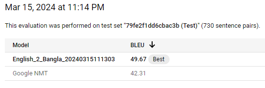

# An Exploration of Machine Translation

## Introduction

In our ever expanding and globalized world, effective communication across language barriers is crucial for fostering connections and facilitating collaboration. Language translation plays a vital role in bridging these gaps, which enables individuals and businesses to interact seamlessly across diverse linguistic landscapes. In this project, I explore various techniques for language translation, such as machine learning and the very cutting edge of deep learning with large language models. My objective is to develop a versatile language translation application that can empower users to overcome language barriers effortlessly. Through a combination of experimentation with different models and methodologies, I aim to evaluate the accuracy and effectiveness of each approach. 

## Methodology

#### MarianMT

One process for text translation  is to utilize pre-trained models. MarianMT is a neural machine translation model that was developed by the Helsinki-NLP team. MarianMT is capable of translating text from one language to another with high accuracy and efficiency. This model is written in C++11, and makes use of an RNN-based encoder, and a transformer decoder. The transformer architecture here very closely follows Vaswani et al. 2017 paper "Attention Is All You Need." MarianMT framework is also inspired by Moses (Koehn et al., 2007), in which encoders and decoders are represented as classes with specific functions. This allows MarianMT the flexibility to have different types of encoder and decoder architecture. This simplifies the process of training, scoring, and translating with new models by providing a standardized interface. Interestingly, the MarianMT model grew out of a C++ implemenation of Nematus (Sennrigh et al,. 2017b), and by using the Moses architecture allowing them to use a transformer decoder meant a significant improvement in the BLEU score by 1.2 points. 
With this model, we can take advantage of OPUS-MT, which has a repository of over 1,000 pre-trained NMT models. This greatly simplifies the process of building translation systems and allows developers to focus on fine-tuning or adapting the pretrained models to specific domains or use cases.
This model was selected for its strong performance in language translation and its support for a wide range of language pairs. 

###### Model Selection and Configuration
In my progam, we can instantiat the MarianMT model with the appropriate configuration based on the selected source and target languages. These languages can be selected from dropdown menus in the webapp. The model architecture and parameters are then automatically loaded from the pretrained checkpoint corresponding to the chosen language pair. However, not all language pairs are available through the dropdown menu, and sometimes these translations only go one way. 

###### Translation Process
The translation process involves tokenizing the input text using the Marian tokenizer and encoding it into input IDs suitable for the model. We then utilized the generate method of the MarianMT model to translate the input text into the target language. The translated text is decoded from the output IDs using the tokenizer, and any special tokens are skipped to obtain the final translated text.

###### Evaluation Metrics
To assess the accuracy of the translation, I implemented the BLEU (Bilingual Evaluation Understudy) score, a common metric used to evaluate the quality of machine translation outputs. The BLEU score measures the similarity between the machine-generated translation and human reference translations, providing a quantitative measure of translation quality.

###### User Interface
I developed a Streamlit web application called LinguaWave Translate to facilitate text translation tasks. The user interface allows users to select the source and target languages, input the text to be translated, and visualize the translated text along with sentiment analysis scores and BLEU score comparisons.

###### Conclusion
The methodology outlined above details my approach to text translation using the MarianMT model within the LinguaWave Translate application. By leveraging state-of-the-art NMT techniques and evaluation metrics, I aim to provide users with accurate and reliable translations across a wide range of languages.

#### AutoML English to Bangla

I also chose to try my hand at using Google's AutoML to improve Googles base NMT. This looked like it might be an easy way for me to train my own neural network while getting the benefit of Googles massive resources. I chose to use the Bengali language because my wife is a native Bangla speaker. This would mean that she could ascertain whether the training was any good, and could tell me if I was able to improve on Googles NMT.

###### Data Collection
I actually found a really good datasource for machine translation from a Pytorch article by Sean Robertson where he was explaining how to make a Seq2Seq neural network with attention from scratch. His project was focused on machine translation as well. That article pointed towards a StackOverflow question about where to get translation data. There is a plethora of translation data from the Tatoeba Project, however, there was one answer that pointed a website where someone had collected all the data together, compiled into CSVs and each language pair was available for download. https://www.manythings.org/anki/ 
From here, I got an English to Bengali dataset that had 6,513 translations. My wife briefly looked them over and said they were good. The document was tab seperated, but the third column held information about who translated the lines and on what date. In order not to introduce a random variable into the training data, if AutoML would even accept it. I had to use the Pandas library to remove the third column and resave it as a TSV file. 

###### Model Training
It was fairly easy to log into AutoML and upload the data. The training all took place in the cloud. So, after uploading the training document, I could hit train and go to bed. AutoML automatically splits the data into train and test sets. Ultimately, the test set was 730 sentence pairs while the rest were used for training.

###### Evaluation Metrics
After training the initial model, the performance was evaluated using the BLEU score metric. The BLEU score provides a measure of the quality of machine-translated text compared to reference translations. The initial BLEU score obtained was 42.31. My models BLEU score is 49.67! An increase of 7.36. I think that is a great increase from such a small dataset. In the Google AutoML interface, you are able to test your model against the base Google NMT model. My wife said that the translations from my model were slightly better and often made a little more sense than the Google NMT model. 

###### User Interface
Unfortunately, at the time of writing this report, I have not been able to the AutoML API integrated into my application. It was not as straightforward as I initially thought. I tried to follow the documentation but ended up getting lost. I dropped it to focus on making other parts of my application better.

###### Conclusion
AutoML is a great way to easily train your own model without having to build one from scratch. I would definitely recommend it if you are able to afford it. It does seem a little pricey when you get to large datasets. AutoML lets you have $300 of free training time, and I used about half of that when I was training the model with only 6,500 lines. It probably took less than three hours to train total, but I was actually very interested in obtaining a much larger Bengali/English dataset. I had thought about using the Bible to train the model further, but it would likely cost more than I want to pay at this time. I thought about choosing the Bible to train with because all of the lines are numbered so it's easier to evaluate the translations here. When I was looking using Wikipedia, I asked my wife if the pages said the same thing, and she told me that they do, but they are structured differently. On the wiki page for the Bengali language, she said that the introdocutory paragraphs for English and Bengali were switched. This might make it a headache to train with that data. 

#### ChatGPT

ChatGPT (GPT3) took the world by storm when it first entered the stage in late 2022 and early 2023. While large language models are not specifically designed for translation purposes, they may have attained a sufficient degree of technical sophistication whre they are able to match or surpass dedicated translation systems like that of Google Translate or DeepL. There is no need to preprocess any data, as GPT3.5 has been pre-trained on a diverse range of text data. ChatGPT supports more than 50 languages, and OpenAI is working on adding many more. However, at this time, GPT is really only good at translating high resource languages. In low resource languages, it is often found that ChatGPT will ignore non-gendered pronouns. This can perpetuate gender bias where GPT will resort to stereotypes and historical gender roles. It often will not convert English gender neutral pronouns into the equivalent in other languages either (Sourojit Ghosh et al., 2023). ChatGPT will default to conferring higher respect to men than to women as is often seen in most AI algorithms. Sourojit Ghosh tested this in 2023 in Bengali, the 7th most spoken language in the world, and 5 other low resource languages. However, when attempting to replicate this myself, with my wife who is a native Bengali speaker, I wasn't able to exactly replicate the gender bias. Hopefully, that means that OpenAI is working on cleaning up some of the bias in these languages, however, their is still a negative ethical implication. 

###### Translation Process:
Translating with GPT is a fairly straightforward process. In order to access the model, you will need an API key. The function that I wrote will take the text as input, and also take the source and target languages as input as well. The function constructs the prompt from the input and sends it along with the API key to the server. I am using the "gpt-3.5-turbo-instruct" model. The instruct model is fine-tuned to follow explicit instructions from the user. I am using in this context over the normal "gpt-.5-turbo" because I want to more accurately control how it is translating tasks, and for it to tell us when it is confused by words or context. 

###### Evaluation Metrics
To assess the accuracy of the translation, I implemented the BLEU (Bilingual Evaluation Understudy) score, a common metric used to evaluate the quality of machine translation outputs. The BLEU score measures the similarity between the machine-generated translation and human reference translations, providing a quantitative measure of translation quality.

###### User Interface
I developed a Streamlit web application called LinguaWave Translate to facilitate text translation tasks. The user interface allows users to select the source and target languages, input the text to be translated, and visualize the translated text along with sentiment analysis scores and BLEU score comparisons. Upon clicking the "Translate" button, the application triggers the translation function (GPT_translate_text) with the input text and language preferences.

###### Conclusion
The ChatGPT text translation functionality can be integrated into various applications and platforms to facilitate communication across language barriers. Despite its effectiveness, the ChatGPT text translation approach may have limitations, such as occasional inaccuracies or inability to handle specialized terminology. Future work could focus on fine-tuning the translation model, incorporating user feedback mechanisms, and expanding language support to address these limitations and enhance overall performance.

#### Speech to Text, then Text to Speech Translation

In my application, I thought that it would be very cool to implement a speech to speech translation. Using this approach, I utilized libraries that would transcribe speech, and ones that would convert that text to audio. At first, I tried to use the OpenAI API, however, I found that their documentation might be out of date. I wasted too much time, so I just moved on. Ultimately, I just ended up using the Google and pytts libraries. I would have liked to have a better AI voice, but this works and I'm happy with it. 

###### User Interface
A Streamlit web application interface is developed to facilitate speech-to-text translation. Users are provided with options to select the source language (language spoken during speech input) and the target language (language for translated text output).

#### Webpage Translation

## Results

## Business Applications
The multilingual translation capabilities offered by the LinguaWave Translate application hold significant potential for real-time translation scenarios.

###### Tourism and Travel: 
Tourists visiting foreign countries often encounter language barriers when communicating with locals, navigating transportation systems, or accessing essential services. The translation tool enables tourists to translate spoken or written phrases in real time, facilitating seamless communication with locals, and obtaining directions or assistance. This enhances the travel experience, promotes cultural immersion, and fosters positive interactions between tourists and locals.

###### Cross-Cultural Relationships: 
Individuals in relationships with partners from different linguistic backgrounds, such as having in-laws who speak another language, face challenges in effective communication and bonding with family members. The translation application allows users to translate conversations during family gatherings, dinners, or social events, enabling meaningful interactions and strengthening familial relationships despite language differences. This promotes inclusivity, understanding, and harmony within multicultural households.

###### Business Meetings and Conferences: 
Professionals attending international business meetings, conferences, or negotiations often require instantaneous translation to participate effectively and engage with counterparts from diverse linguistic backgrounds. The translation tool facilitates real-time interpretation of spoken or written content, allowing participants to communicate, exchange ideas, and collaborate seamlessly across languages. This enhances business communication, expands networking opportunities, and fosters international partnerships and collaborations.(DO NOT RECOMMEND WITHOUT BUILDING OUT FURTHER AND ONLY IN HIGH RESOURCE LANGUAGES WITH LITTLE CHANCE OF MISUNDERSTANDING)

###### Education and Language Learning: 
Language learners seeking immersive language experiences can utilize the translation application to practice conversational skills, receive feedback, and engage with native speakers in real time. Whether participating in language exchange programs, virtual language classes, or online tutoring sessions, learners can benefit from immediate translation assistance, contextual understanding, and cultural insights, accelerating language acquisition and fluency development.

###### Emergency Situations and Crisis Management: 
In emergency situations, such as accidents, natural disasters, or medical emergencies, effective communication is essential for ensuring timely assistance and support. The translation tool enables first responders, healthcare professionals, and individuals in distress to communicate vital information, convey urgent needs, and coordinate rescue efforts across language barriers. This facilitates efficient emergency response, enhances safety, and saves lives in critical situations.

Overall, the LinguaWave Translate application serves as a versatile and indispensable tool for individuals navigating diverse linguistic environments, empowering them to communicate effectively, connect with others, and overcome language barriers in real time. Whether traveling, socializing, conducting business, or managing emergencies, users can rely on the translation application to facilitate seamless communication and enrich their experiences in a globalized world.

## Conclusion
The report delves into the exploration of machine translation techniques, focusing on the development of the LinguaWave Translate application. This project aims to address the crucial need for effective communication across language barriers in our increasingly globalized world. By leveraging state-of-the-art machine learning and deep learning models, the application offers versatile language translation capabilities to empower users in various domains.

Methodology Overview:
MarianMT: Utilizes pre-trained models from the Helsinki-NLP team, offering high-accuracy translation using a combination of RNN-based encoders and transformer decoders. The framework provides a standardized interface for training, scoring, and translating new models, simplifying the process for developers.

AutoML English to Bangla: Explores the use of Google's AutoML to enhance Google's base NMT model for English to Bengali translation. The training process involves data collection from the Tatoeba Project, model training in the cloud, and evaluation using BLEU scores. The resulting model demonstrates a significant improvement in translation quality.

ChatGPT: Integrates OpenAI's ChatGPT (GPT3) model for text translation, leveraging its large language model to perform translation tasks. Despite occasional limitations, such as gender bias in low-resource languages, ChatGPT offers a convenient solution for real-time translation needs.

Speech to Text, then Text to Speech Translation: Implements a speech-to-text and text-to-speech translation feature using libraries like Google's speech recognition and pyttsx3. While encountering challenges with API integration, the functionality provides a practical solution for real-time translation scenarios.

Business Applications:
The LinguaWave Translate application holds immense potential for diverse business applications, catering to tourists, individuals in cross-cultural relationships, professionals in global business settings, language learners, and emergency responders. The application facilitates seamless communication, cultural exchange, and collaboration across languages, enhancing user experiences and promoting inclusivity in a globalized society.

Conclusion:
Through a comprehensive exploration of machine translation techniques and the development of the LinguaWave Translate application, this project demonstrates the efficacy of leveraging cutting-edge technologies to overcome language barriers. By offering a user-friendly interface, accurate translations, and real-time capabilities, the application serves as a valuable tool for fostering communication, cultural exchange, and collaboration in diverse linguistic contexts. As technology continues to advance, further refinements and enhancements to the application can be expected, contributing to its utility and impact in facilitating global communication.

## Literature
Bahdanau, D., Cho, K., & Bengio, Y. (2016a, May 19). Neural machine translation by jointly learning to align and translate. arXiv.org. https://arxiv.org/abs/1409.0473 

Junczys-Dowmunt, M., Grundkiewicz, R., Dwojak, T., Hoang, H., Heafield, K., Neckermann, T., Seide, F., Germann, U., Aji, A. F., Bogoychev, N., Martins, A. F. T., & Birch, A. (2018, April 4). Marian: Fast neural machine translation in C++. arXiv.org. https://arxiv.org/abs/1804.00344 

Koehn, P., Hoang, H., Birch, A., Callison-Burch, C., Federico, M., Bertoldi, N., Cowan, B., Shen, W., Moran, C., Zens, R., Dyer, C., Bojar, O., Constantin, A., & Herbst, E. (2013, May 9). Moses: Open source toolkit for statistical machine translation. University of Edinburgh Research Explorer. https://www.research.ed.ac.uk/en/publications/moses-open-source-toolkit-for-statistical-machine-translation 

Robertson, S. (n.d.). NLP from scratch: Translation with a sequence to sequence network and attention¶. NLP From Scratch: Translation with a Sequence to Sequence Network and Attention - PyTorch Tutorials 2.2.1+cu121 documentation. https://pytorch.org/tutorials/intermediate/seq2seq_translation_tutorial.html 

Sourojit Ghosh Human Centered Design and Engineering, Ghosh, S., Engineering, H. C. D. and, School, A. C. T. I., Caliskan, A., School, T. I., Ibm, University, G. M., University, A. N., Technology, C. for T., London, & Metrics, O. M. A. (2023, August 1). CHATGPT perpetuates gender bias in machine translation and ignores non-gendered pronouns: Findings across Bengali and five other low-resource languages: Proceedings of the 2023 AAAI/ACM Conference on AI, Ethics, and Society. ACM Conferences. https://dl.acm.org/doi/abs/10.1145/3600211.3604672 

Tab-delimited bilingual sentence pairs these are selected sentence pairs from the TATOEBA project. Tab-delimited Bilingual Sentence Pairs from the Tatoeba Project (Good for Anki and Similar Flashcard Applications). (n.d.). https://www.manythings.org/anki/ 

Tiedemann, J., & Thottingal, S. (n.d.). Opus-mt – building open translation services for the world. ACL Anthology. https://aclanthology.org/2020.eamt-1.61/ 

Vaswani, A., Shazeer, N., Parmar, N., Uszkoreit, J., Jones, L., Gomez, A. N., Kaiser, L., & Polosukhin, I. (2023, August 2). Attention is all you need. arXiv.org. https://arxiv.org/abs/1706.03762 
